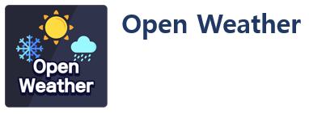
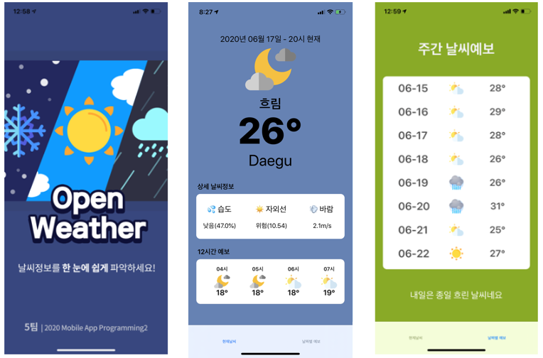

<h1 align="center">
    
  </a>
</h1>

<h2 align="center">
  Swift Open Weather App
</h2>

<p align="center"> 현재 위치를 기반으로 날씨와 관련된 다양한 정보를 제공하는 애플리케이션</p>
<p align="center">  </p>


## 📋 　기능
✔ 　실시간 날씨(온도, 습도, 자외선, 바람 세기) 정보 제공  
✔ 　현재 시간을 기준으로 12시간(1시간 단위) 날씨 정보 제공  
✔ 　현재 날짜를 기준으로 7일(1일 단위) 날씨 정보 제공  
✔ 　날씨에 따른 문구 알림(ex) 비, 눈이 오는 경우 미리 준비할 수 있도록 한다.)  
✔ 　애플리케이션을 실행하는 것만으로도 새로운 정보를 받아올 수 있다.  

## ✋ 　실행하는 법
### Clone
- MobileAppProgramming2 repository를 clone 하여 본인의 컴퓨터로 가져온다.
### Pod Setup
1. 위 파일이 위치한 곳에서 터미널을 키고 pod init을 실행한다.
```
pod init
```
2. PodFile을 열어서 아래 코드를 추가한다.
```
pod 'Alamofire', '~> 4.5'
pod 'SwiftyJSON'
```
3. pod를 설치한다.
```
pod install
```
4. xcodeworkspace를 열어서 실행한다
```
open xcodeworkspace
```
### Execute
- Simulator 혹은 휴대폰을 연결하여 실행


## 🎬 　데모 영상


### 🚀 　오픈 소스 주소

https://openweathermap.org/ 에서 API Key를 발급받은 후 CurrentWeather Data와 One Call API를 사용하였습니다.
## Current Weather
```
{"coord": { "lon": 139,"lat": 35},
  "weather": [
    {
      "id": 800,
      "main": "Clear",
      "description": "clear sky",
      "icon": "01n"
    }
  ],
  "base": "stations",
  "main": {
    "temp": 281.52,
    "feels_like": 278.99,
    "temp_min": 280.15,
    "temp_max": 283.71,
    "pressure": 1016,
    "humidity": 93
  },
  "wind": {
    "speed": 0.47,
    "deg": 107.538
  },
  "clouds": {
    "all": 2
  },
  "dt": 1560350192,
  "sys": {
    "type": 3,
    "id": 2019346,
    "message": 0.0065,
    "country": "JP",
    "sunrise": 1560281377,
    "sunset": 1560333478
  },
  "timezone": 32400,
  "id": 1851632,
  "name": "Shuzenji",
  "cod": 200
}
```
## One Call
```
  {
  "lat": 33.44,
  "lon": -94.04,
  "timezone": "America/Chicago",
  "timezone_offset": -18000,
  "current": {
    "dt": 1588935779,
    "sunrise": 1588936856,
    "sunset": 1588986260,
    "temp": 16.75,
    "feels_like": 16.07,
    "pressure": 1009,
    "humidity": 93,
    "dew_point": 15.61,
    "uvi": 8.97,
    "clouds": 90,
    "visibility": 12874,
    "wind_speed": 3.6,
    "wind_deg": 280,
    "weather": [
      {
        "id": 501,
        "main": "Rain",
        "description": "moderate rain",
        "icon": "10n"
      },
      {
        "id": 200,
        "main": "Thunderstorm",
        "description": "thunderstorm with light rain",
        "icon": "11n"
      }
    ],
    "rain": {
      "1h": 2.79
    }
  },
   "minutely": [
    {
      "dt": 1588935780,
      "precipitation": 2.789
    },
    ...
  },
  "hourly": [
      {
      "dt": 1588935600,
      "temp": 16.75,
      "feels_like": 13.93,
      "pressure": 1009,
      "humidity": 93,
      "dew_point": 15.61,
      "clouds": 90,
      "wind_speed": 6.66,
      "wind_deg": 203,
      "weather": [
        {
          "id": 501,
          "main": "Rain",
          "description": "moderate rain",
          "icon": "10n"
        }
      ],
      "rain": {
        "1h": 2.92
      }
    },
    ...
  }
    "daily": [
        {
      "dt": 1588960800,
      "sunrise": 1588936856,
      "sunset": 1588986260,
      "temp": {
        "day": 22.49,
        "min": 10.96,
        "max": 22.49,
        "night": 10.96,
        "eve": 18.45,
        "morn": 18.14
      },
      "feels_like": {
        "day": 18.72,
        "night": 6.53,
        "eve": 16.34,
        "morn": 16.82
      },
      "pressure": 1014,
      "humidity": 60,
      "dew_point": 14.35,
      "wind_speed": 7.36,
      "wind_deg": 342,
      "weather": [
        {
          "id": 502,
          "main": "Rain",
          "description": "heavy intensity rain",
          "icon": "10d"
        }
      ],
      "clouds": 68,
      "rain": 15.38,
      "uvi": 8.97
    },
    ...
    }
```
